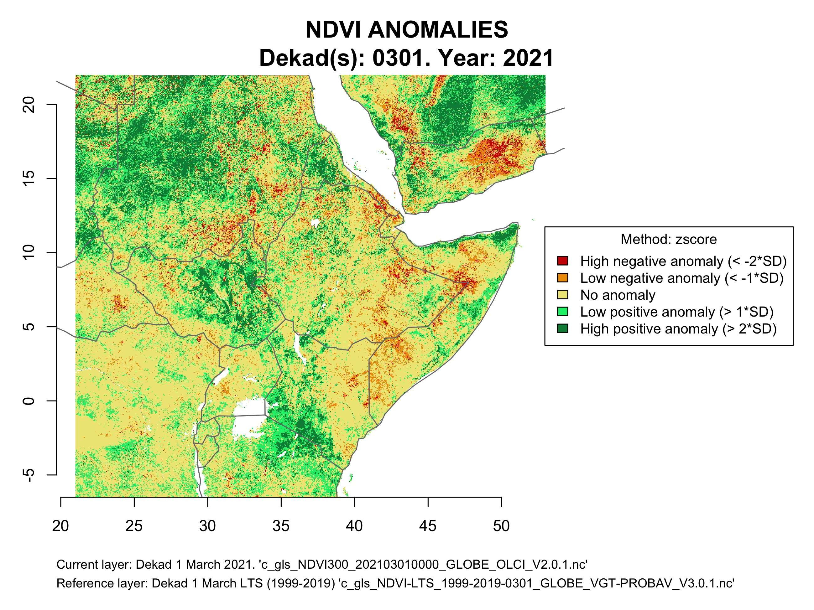

## Purpose

This notebook shows how to detect vegetation anomalies using Copernicus Global Land Service (CGLS) products (i.e. NDVI), based on the comparison of one product with the Long Term Statistics (LTS) product provided by the CGLS. We use R-based packages and functions for the calculations.

Currently, CGLS provides only LTS (i.e. statistics of time series 1999-2019) for NDVI. However, the rationale behind the methodology showed in this notebook can be implemented to any other product, bearing in mind that the reference product has to be calculated and/or provided by the user. 

Another consideration is that the NDVI-LTS product provided by the CGLS has a resolution of ca. 1km, while the new provided products as of July 2020 have a resolution of ca. 333m. This means that the product to be analysed has to be resampled accordingly (see below). For more details on the products, please see the description and Product User Manuals documentation at https://land.copernicus.eu/global/themes/vegetation


## Step 1: Downloading the input product files

There are several options to obtain the data from the CGLS servers. For example, you can choose to automatically download the products using the R-based functions found in https://github.com/cgls/Copernicus-Global-Land-Service-Data-Download-with-R. Alternatively, you can download the data directly from the [website](https://land.copernicus.vgt.vito.be/PDF/portal/Application.html#Browse;Root=513186;Time=NORMAL,NORMAL,-1,,,-1,,). For either option, you have to be registered.


## Step 2: Reading in and pre-processing the data

Once the data set is available, *ncdf4* and *raster* packages functionalities are used to prepare it for the calculations. 

```{r}
if(require(ncdf4) == FALSE){install.packages("ncdf4", repos = "https://cloud.r-project.org"); library(ncdf4)} else {library(ncdf4)}
if(require(raster) == FALSE){install.packages("raster", repos = "https://cloud.r-project.org"); library(raster)} else {library(raster)}


# Defining directory with the files
dirctry <- "<your directory>"
setwd(dirctry)
```

&nbsp;


In order to illustrate this notebook, we will make the calculations for a particular area of interest (AOI), the Horn of Africa. For that, we will subset this AOI.

```{r}
# Coordinates for subsetting AOI
coords4subset <- c(21, 53, -6.5, 22)  # Horn of Africa
```

&nbsp;


We will calculate the anomalies for a particular dekad (i.e. March 1). However, we might want to run the analysis for an entire month/quarter/year. In this case we should make averages of the dekads (i.e. period of 10 days; CGLS provides the products by dekad).

We start reading in the LTS (1999-2019) dekad(s).

```{r}
# LTS files avialable/to be analised
all_files <- list.files(pattern = "nc$", full.names = TRUE)
all_files <- all_files[grepl("LTS", all_files)]
all_files

# Extracting the dekads to be analysed
all_files1 <- all_files
all_files1 <- gsub("./c_gls_NDVI-LTS_1999-2019-", "", all_files1)
all_files1 <- gsub("_GLOBE_VGT-PROBAV_V3.0.1.nc", "", all_files1)
dekads <- all_files1
dekads

# Alternatively, it/they can be hardcoded
dekads <- c("0301", "0311", "0321")

# In our case
dekads <- c("0301")

# Selecting LTS files
all_files <- all_files[grepl(dekads, all_files)]
all_files
```

&nbsp;


The NDVI-LTS product has several variables. We will need "mean" and "stdev" (i.e. standard deviation). We create a *RasterBrick* with both variables and, then, we crop them to the AOI. However, before the coordinates of the new AOI can be used, they have to be adjusted to coincide with the CGLS products grid to be able to properly be compared with the 333m product after being resampled to 1km. See https://github.com/xavi-rp/ResampleTool_notebook for further explanations on this matter.

Please notice as well that, when using *raster::raster()* for reading *nc* files, there are certain floating point imprecisions for the scalation of the values, stored in the file as digital numbers, into real physical values. R uses IEEE-754-Standard double-precision floating-point numbers, whereas the values in the *netCDF* are stored as float32. For this reason, the NA values in the *RasterBrick* need to be slightly adjusted.

```{r}
# Creating a RasterBrick with adjusted coordinates for LTS (1999-2019) 
# We run everything in a loop in case there are more than one dekad to be prepared
for(fl in 1:length(all_files)){
  ndvi_lts_1km_rstr <- raster(all_files[fl], varname = "mean")
  ndvi_lts_1km_rstr_sd <- raster(all_files[fl], varname = "stdev")
  ndvi_lts_1km_rstr <- brick(ndvi_lts_1km_rstr, ndvi_lts_1km_rstr_sd)
  names(ndvi_lts_1km_rstr) <- c("mean", "sd")
  
  # Adjusting my_extent to coordinates belonging to the 1km grid (if necessary)
  my_extent <- extent(coords4subset)
    
  # The following vectors contain Long and Lat coordinates, respectively, of the 1km grid (cell boundaries):
  x_ext <- seq((-180 - ((1 / 112) / 2)), 180, (1/112))
  y_ext <- seq((80 + ((1 / 112) / 2)), - 60, - (1/112))
    
  if(!all(round(my_extent[1], 7) %in% round(x_ext, 7) &
          round(my_extent[2], 7) %in% round(x_ext, 7) &
          round(my_extent[3], 7) %in% round(y_ext, 7) &
          round(my_extent[4], 7) %in% round(y_ext, 7))){
    for(crd in 1:length(as.vector(my_extent))){
      if(crd <= 2){
        my_extent[crd] <- x_ext[order(abs(x_ext - my_extent[crd]))][1]
      }else{
        my_extent[crd] <- y_ext[order(abs(y_ext - my_extent[crd]))][1]
      }
    }
  }
  
  # Cropping to the AOI
  ndvi_lts_1km_rstr <- crop(ndvi_lts_1km_rstr, my_extent)
  
  # Adjusting NAs
  ndvi_lts_1km_rstr_clean <- ndvi_lts_1km_rstr$mean
  ndvi_lts_1km_rstr_clean[ndvi_lts_1km_rstr_clean >= 0.9359999] <- NA
                                                        
  ndvi_lts_1km_rstr_clean_sd <- ndvi_lts_1km_rstr$sd
  ndvi_lts_1km_rstr_clean_sd[ndvi_lts_1km_rstr_clean_sd >= 1.016] <- NA
    
  ndvi_lts_1km_rstr_clean <- brick(ndvi_lts_1km_rstr_clean, ndvi_lts_1km_rstr_clean_sd)
  names(ndvi_lts_1km_rstr_clean) <- c("mean", "sd")
    
  # Saving prepared RasterBrick as a GeoTiff file
  writeRaster(ndvi_lts_1km_rstr_clean, filename = paste0("ndvi_lts_1km_rstr_clean_", dekads[fl], ".tif"), overwrite = TRUE)
  
}
```

&nbsp;


Then, it is the turn of the actual dekad(s) we want to analise. The process is the same except that the actual product has to be resampled from 333m to 1km. For this process we will use the method descrived in this [Notebook](https://github.com/xavi-rp/ResampleTool_notebook) 

```{r}
# Actual avialable files 
all_files <- list.files(pattern = "nc$", full.names = TRUE)
all_files <- all_files[!grepl("LTS", all_files)]

# Selecting actual files to be analised
all_files <- all_files[grepl(dekads, all_files)]
all_files

for(fl in 1:length(all_files)){

  ndvi_300m_rstr <- raster(all_files[fl])
  
  # Adjusting my_extent to coordinates belonging to the 1km grid (if necessary)
  my_extent <- extent(coords4subset)
  
  # The following vectors contain Long and Lat coordinates, respectively, of the 1km grid (cell boundaries):
  x_ext <- seq((-180 - ((1 / 112) / 2)), 180, (1/112))
  y_ext <- seq((80 + ((1 / 112) / 2)), - 60, - (1/112))
  
  if(!all(round(my_extent[1], 7) %in% round(x_ext, 7) &
          round(my_extent[2], 7) %in% round(x_ext, 7) &
          round(my_extent[3], 7) %in% round(y_ext, 7) &
          round(my_extent[4], 7) %in% round(y_ext, 7))){
    for(crd in 1:length(as.vector(my_extent))){
      if(crd <= 2){
        my_extent[crd] <- x_ext[order(abs(x_ext - my_extent[crd]))][1]
      }else{
        my_extent[crd] <- y_ext[order(abs(y_ext - my_extent[crd]))][1]
      }
    }
    
    # Now we can crop the 300m raster to the AOI
    ndvi_300m_rstr <- crop(ndvi_300m_rstr, my_extent)
  }

  # Adjusting NAs
  ndvi_300m_rstr_clean <- ndvi_300m_rstr
  ndvi_300m_rstr_clean[ndvi_300m_rstr_clean >= 0.9359999] <- NA   
  
  # Saving prepared RasterBrick as a GeoTiff file
  writeRaster(ndvi_300m_rstr_clean, filename = paste0("ndvi_300m_rstr_clean_", dekads[fl], ".tif"), overwrite = TRUE)
  
  
  ## Resampling using the 'Aggregation' method
  # see https://github.com/xavi-rp/ResampleTool_notebook
  mean_w.cond <- function(x, ...){ # mean including condition 'minimum 5 valid pixels'
    n_valid <- sum(!is.na(x)) # number of cells with valid value
    if(n_valid > 4){
      dts <- list(...)
      if(is.null(dts$na_rm)) dts$na_rm <- TRUE
      x_mean <- mean(x, na.rm = dts$na_rm)
      return(x_mean)
    }else{
      x_mean <- NA
      return(x_mean)
    }
  }
  
  aggr_method <- "mean_w.cond"
  ndvi_1km_rstr_clean <- aggregate(ndvi_300m_rstr_clean,
                                   fact = 3, # from 333m to 1km  
                                   fun = aggr_method, 
                                   na.rm = TRUE, 
                                   filename = paste0("ndvi_1km_rstr_clean_", dekads[fl], ".tif"),
                                   overwrite = TRUE)
}
```

&nbsp;


Now, if we want to calculate the anomalies for a period longer than a dekad (e.g. a month), we have to average the necessary dekads. 

```{r}
# Averaging ctual dekads
all_files <- list.files(pattern = "tif$", full.names = TRUE)
all_files <- all_files[!grepl("300", all_files)]
all_files <- all_files[!grepl("lts", all_files)]
all_files <- all_files[!grepl("anomalies", all_files)]
all_files <- all_files[grepl("clean", all_files)]
all_files

ndvi_1km_avrgPeriod <- raster(all_files[1])
for(fl in 2:length(all_files)){
  ndvi_1km_avrgPeriod <- stack(ndvi_1km_avrgPeriod, raster(all_files[fl]))
}

# Parallelising the process
cores2use <- 3
beginCluster(cores2use)
ndvi_1km_avrgPeriod <- clusterR(ndvi_1km_avrgPeriod, calc, args = list(fun = mean))
endCluster()

writeRaster(ndvi_1km_avrgPeriod, filename = paste0("ndvi_1km_avrg_", "<Period>", ".tif"), overwrite = TRUE)

```


For the LTS the method is similar, but remember that the average of the means can be directly calculated, but the average of the SD can't. For the "averaged" SD, we have to calculate square root of the pooled (or weighted) variances (see e.g. http://www.talkstats.com/threads/an-average-of-standard-deviations.14523/)

```{r}
# Averaging Long Term Statistics
all_files <- list.files(pattern = "tif$", full.names = TRUE)
all_files <- all_files[grepl("lts", all_files)]
all_files <- all_files[grepl("clean", all_files)]
all_files

# Mean
ndvi_lts_1km_mean_avrgPeriod <- stack(all_files[1])[[1]]
for(fl in 2:length(all_files)){
  ndvi_lts_1km_mean_avrgPeriod <- stack(ndvi_lts_1km_mean_avrgPeriod, stack(all_files[fl])[[1]])
}

beginCluster(cores2use)
ndvi_lts_1km_mean_avrgPeriod <- clusterR(ndvi_lts_1km_mean_avrgPeriod, calc, args = list(fun = mean))
endCluster()

writeRaster(ndvi_lts_1km_mean_avrgPeriod, filename = paste0("ndvi_lts_1km_mean_avrg_", "<Period>", ".tif"), overwrite = TRUE)


## SD
SD_avrge <- function(x) {sqrt((sum(x^2)/length(x)))}   # square root of the pooled (or weighted) variances

ndvi_lts_1km_sd_avrgPeriod <- stack(all_files[1])[[2]]
for(fl in 2:length(all_files)){
  ndvi_lts_1km_sd_avrgPeriod <- stack(ndvi_lts_1km_sd_avrgPeriod, stack(all_files[fl])[[2]])
}
ndvi_lts_1km_sd_avrgPeriod

beginCluster(3)
ndvi_lts_1km_sd_avrgPeriod <- clusterR(ndvi_lts_1km_sd_avrgPeriod, calc, args = list(fun = SD_avrge))
endCluster()

writeRaster(ndvi_lts_1km_sd_avrgPeriod, filename = paste0("ndvi_lts_1km_sd_avrg_", "<Period>", ".tif"), overwrite = TRUE)

```

&nbsp;


## Step 3: Calculating anomalies

At this point, we can really start calculating the anomalies. But first, we load the needed libraries and define some parameters to be used along the process.

```{r}
# 'rworldmap' will be used to get information of countries limits in case we want to subset the data using one or several countries/continents
if(require(rworldmap) == FALSE){install.packages("rworldmap", repos = "https://cloud.r-project.org"); library(rworldmap)} else {library(rworldmap)}
```

&nbsp;


There are different methods to calculate anomalies, which can be easily found in scientific bibliography. In this Notebook we will propose two methods: z-score and a simpler one.

- Absolute differences with respect to the corresponding long-term average (see e.g. Meroni, et al., 2014; https://doi.org/10.1080/01431161.2014.883090). We call it "simple" in this Notebook.

- Z-score (see e.g. Meroni et al., 2019; https://doi.org/10.1016/j.rse.2018.11.041):

    Z = (NDVIactual - NDVI_LTSmean) / NDVI_LTSsd

&nbsp;

```{r}
anom_method <- "simple"
anom_method <- "zscore"
```

&nbsp;


We have to define a threshold for anomalies classification (i.e. distinguish what is an anomaly and what is not). We will define two threshols, so that we will have at the end 4 classes of anomalies (i.e. 2 positive and 2 negatives) plus a 5^th class belonging to the normal situation (i.e. no anomalies). The thresholds can be randomly defined by the user or based on the SD of the LTS.

```{r}
# Random thresholds
anom1 <- 0.05
anom2 <- 0.125

# Or SD-based
anom1 <- "1*SD"   # in the form value*SD
anom2 <- "2*SD"   # in the form value*SD
```

&nbsp;


Now we define the country(ies) or the continent to focuss the analysis. *NULL* will define no selection. For the case we are using to illustrate this Notebook, we will set it as *NULL*, as we have already subset the AOI before.

```{r}
# Some examples
cntry <- "Africa"
cntry <- "Europe"
cntry <- "Kenya"
cntry <- c("Italy", "France")
cntry <- NULL
```

&nbsp;


Then, we call the World map, select the countries/continent and subset the *RasterLayers* we want to analyse (only if *cntry* is not *NULL*).

```{r}
wrld_map <- getMap()

selectedMap <- wrld_map[wrld_map$REGION %in% cntry | wrld_map$NAME %in% cntry, ]

# Actual dekad(s)
if(!is.null(cntry)){
  ndvi_1km_rstr_clean <- crop(ndvi_1km_rstr_clean, extent(selectedMap))
  ndvi_1km_rstr_clean <- mask(ndvi_1km_rstr_clean, selectedMap)
}

# LTS-mean
ndvi_lts_1km_mean_rstr_clean <- ndvi_lts_1km_rstr_clean[[1]]
names(ndvi_lts_1km_mean_rstr_clean) <- c("mean")
if(!is.null(cntry)){
  ndvi_lts_1km_mean_rstr_clean <- crop(ndvi_lts_1km_mean_rstr_clean, extent(selectedMap))
  ndvi_lts_1km_mean_rstr_clean <- mask(ndvi_lts_1km_mean_rstr_clean, selectedMap)
}

# LTS-SD
ndvi_lts_1km_sd_rstr_clean <- ndvi_lts_1km_rstr_clean[[2]]
names(ndvi_lts_1km_sd_rstr_clean) <- c("sd")
if(!is.null(cntry)){
  ndvi_lts_1km_sd_rstr_clean <- crop(ndvi_lts_1km_sd_rstr_clean, extent(selectedMap))
  ndvi_lts_1km_sd_rstr_clean <- mask(ndvi_lts_1km_sd_rstr_clean, selectedMap)
}
```

&nbsp;


And, then, we can calculate the anomalies using the method defined above.

```{r}
if (anom_method == "simple"){
  ndvi_1km_anomalies <- ndvi_1km_rstr_clean - ndvi_lts_1km_rstr_clean$mean
}else if (anom_method == "zscore"){
  ndvi_1km_anomalies <- (ndvi_1km_rstr_clean - ndvi_lts_1km_rstr_clean$mean) / ndvi_lts_1km_sd_rstr_clean$sd
}else{
  stop("define 'anom_method' as 'simple' or 'zscore")
}

# Saving the results
writeRaster(ndvi_1km_anomalies, "ndvi_1km_anomalies.tif", overwrite = TRUE)
```

&nbsp;


The next step is to apply the threshold to define each pixel with the level of anomaly (if any). The following code automatically calls the method and the thresholds defined previously and apply them taking into account the method used.

```{r}
if(is.numeric(anom1)){
  name2 <- ""  # to be used later, when naming the output 
  
  cuts <- c(minValue(ndvi_1km_anomalies), -anom2, -anom1, anom1, anom2, maxValue(ndvi_1km_anomalies))
  reclass_mtrx <- as.data.frame(cuts)
  names(reclass_mtrx) <- "from"
  reclass_mtrx$to <- c(reclass_mtrx$from[-1], 1)
  reclass_mtrx <- reclass_mtrx[1:(nrow(reclass_mtrx) - 1), ]
  reclass_mtrx$becomes <- 1:5
  
  ndvi_1km_anomalies1 <- reclassify(ndvi_1km_anomalies, rcl = reclass_mtrx, filename = '', include.lowest = TRUE, right = FALSE)
  
}else{
  name2 <- "_sd"  # to be used later, when naming the output 
  ndvi_1km_anomalies1 <- ndvi_1km_anomalies
  
  anom_val2 <- as.numeric(sub("\\*SD$", "", anom2))
  if(anom1 == "SD"){
    anom_val1 <- 1
  }else{
    anom_val1 <- as.numeric(sub("\\*SD$", "", anom1))
  }

  if (anom_method == "simple"){
    ndvi_1km_anomalies1[ndvi_1km_anomalies < (-anom_val2 * ndvi_lts_1km_sd_rstr_clean)]   <- 1 
    ndvi_1km_anomalies1[ndvi_1km_anomalies >= (-anom_val2 * ndvi_lts_1km_sd_rstr_clean)
                        & ndvi_1km_anomalies < (-anom_val1 * ndvi_lts_1km_sd_rstr_clean)] <- 2 
    ndvi_1km_anomalies1[ndvi_1km_anomalies >= (-anom_val1 * ndvi_lts_1km_sd_rstr_clean)
                        & ndvi_1km_anomalies < (anom_val1 * ndvi_lts_1km_sd_rstr_clean)]  <- 3 
    ndvi_1km_anomalies1[ndvi_1km_anomalies >= (anom_val1 * ndvi_lts_1km_sd_rstr_clean)
                        & ndvi_1km_anomalies < (anom_val2 * ndvi_lts_1km_sd_rstr_clean)]  <- 4 
    ndvi_1km_anomalies1[ndvi_1km_anomalies >= (anom_val2 * ndvi_lts_1km_sd_rstr_clean)]   <- 5
  
  }else if (anom_method == "zscore"){
    ndvi_1km_anomalies1[ndvi_1km_anomalies < -anom_val2]   <- 1 
    ndvi_1km_anomalies1[ndvi_1km_anomalies >= -anom_val2
                        & ndvi_1km_anomalies < -anom_val1] <- 2 
    ndvi_1km_anomalies1[ndvi_1km_anomalies >= -anom_val1 
                        & ndvi_1km_anomalies < anom_val1]  <- 3 
    ndvi_1km_anomalies1[ndvi_1km_anomalies >= anom_val1
                        & ndvi_1km_anomalies < anom_val2]  <- 4 
    ndvi_1km_anomalies1[ndvi_1km_anomalies >= anom_val2]   <- 5
  }
}  
```

&nbsp;


## Step 4: Plotting the results

And, finally, we can plot the results.

```{r}
# Setting the year of the analysis to be used when plotting
year <- 2021

jpeg(paste0("ndvi_1km_anomalies_", anom_method, name2, ".jpg"), width = 22, height = 16.5, units = "cm", res = 300)
par(mar = c(6, 3, 4, 12), bty = "n")
pal <- colorRampPalette(c("red3", "orange2" , "khaki2", "springgreen2", "springgreen4"))
par(xpd = FALSE)
plot(ndvi_1km_anomalies1, col = pal(5), legend = FALSE)
plot(wrld_map, add = TRUE, border = "grey47")
par(xpd = TRUE)
legend("right",
       title = paste0("Method: ", anom_method),
       legend = c(paste0("High negative anomaly (< -", anom2, ")"),
                  paste0("Low negative anomaly (< -", anom1, ")"),
                  "No anomaly",
                  paste0("Low positive anomaly (> ", anom1, ")"),
                  paste0("High positive anomaly (> ", anom2, ")")),
       fill = pal(5),
       cex = 0.9,
       inset = - 0.45)
if(!is.null(cntry)){
  name1 <- paste0(cntry, " : ")
}else{
  name1 <- ""
}
title(main = paste0(name1, "NDVI ANOMALIES\nDekad(s): ", paste(dekads, collapse = "; "), ". Year: ", year),
      outer = TRUE,
      line = - 3.5,
      cex.main = 1.5)

mtext("Current layer: <add info about the layer>",
      # e.g. "Current layer: Dekad 1 March 2021. 'c_gls_NDVI300_202103010000_GLOBE_OLCI_V2.0.1.nc'",
      side = 1, line = 3, 
      adj = 0,
      cex = 0.8)
mtext("Reference layer: <add info about the layer>", 
      # e.g. "Reference layer: Dekad 1 March LTS (1999-2019) 'c_gls_NDVI-LTS_1999-2019-0301_GLOBE_VGT-PROBAV_V3.0.1.nc'",
      side = 1, line = 4, 
      adj = 0,
      cex = 0.8)

dev.off()

```

&nbsp;

From the example:




